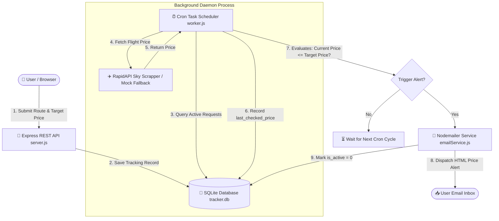

# ✈️ Flight Price Tracker Microservice

> A production-grade, asynchronous backend microservice that monitors real-time flight price fluctuations, schedules periodic background checks via cron workers, and dispatches automated HTML email alerts when prices drop below user target thresholds.

[](https://nodejs.org/)
[](https://expressjs.com/)
[](https://www.sqlite.org/)
[](https://nodemailer.com/)
[](https://flight-price-tracker-ceuy.onrender.com/)

> 🔗 **Live Application URL**: [https://flight-price-tracker-ceuy.onrender.com/](https://flight-price-tracker-ceuy.onrender.com/)

---


## 🌟 Key Highlights & System Architecture

Modern travel search engines rely heavily on background asynchronous tasks to track price fluctuations across third-party airline APIs. This microservice implements a complete, scalable solution:

- ⚡ **Asynchronous Background Processing**: Decouples web API request handling from heavy polling loops using a dedicated background worker (`worker.js`).
- 🛡️ **Rate Limit & Circuit Breaker Protection**: Integrates RapidAPI Sky Scrapper via `axios` with a deterministic mock price fallback engine to prevent 429/404 crashes during rate limit spikes.
- 💾 **State Machine & Persistence**: Tracks active/fulfilled price alerts in SQLite, flipping `is_active = 0` upon successful alert dispatch to guarantee idempotency (no spam emails).
- 📧 **Transactional Email Alerts**: Builds formatted, responsive HTML email notifications dispatched over Nodemailer SMTP.
- 🌐 **Embedded Web Dashboard**: Built-in glassmorphism dark-mode UI for 1-click browser testing and real-time request monitoring.

---

## 📐 System Workflow & Data Flow



---

## 🛠️ Tech Stack & File Architecture

```
flight-tracker/
├── .env.example          # Environment variable template
├── .gitignore            # Excludes secrets (.env) & binaries (*.db, node_modules)
├── amadeusService.js     # RapidAPI Sky Scrapper integration & mock fallback engine
├── db.js                 # SQLite database connection & schema initialization
├── emailService.js       # Nodemailer SMTP engine & template builder
├── package.json          # Dependencies & npm script configurations
├── README.md             # Project documentation
├── server.js             # Express REST API endpoints & Web Dashboard route
├── style.css             # Glassmorphism UI styling for testing dashboard
└── worker.js             # Background Cron worker daemon
```

---

## 🛠️ Technology Responsibilities

| File / Component | Primary Tech | Purpose |
| :--- | :--- | :--- |
| **`server.js`** | Node.js, Express.js | Exposes `POST /api/track` & `GET /api/track` REST endpoints and serves the testing dashboard. |
| **`db.js`** | SQLite3 | Initializes `TrackingRequests` table and manages persistent database connection pool. |
| **`amadeusService.js`** | Axios, RapidAPI | Executes outgoing flight search HTTP requests with custom headers (`x-rapidapi-key`, `x-rapidapi-host`). |
| **`emailService.js`** | Nodemailer, SMTP | Constructs responsive HTML transactional alert templates and dispatches email notifications. |
| **`worker.js`** | node-cron | Runs scheduled background check cycles every 30 seconds for active tracking requests. |
| **`style.css`** | CSS3 (Glassmorphism) | Provides modern typography (`Inter`), custom inputs, gradient buttons, and live status badges. |

---

## 🚀 Quick Start & Local Setup

### 1. Prerequisites
- **Node.js**: `v18.0.0` or higher
- **npm**: `v8.0.0` or higher

### 2. Installation
Clone the repository and install dependencies:
```bash
git clone https://github.com/Devraj-Sisodiya/flight-price-tracker.git
cd flight-price-tracker
npm install
```

### 3. Environment Configuration
Create a `.env` file in the root directory (or copy `.env.example`):
```ini
PORT=3000

# RapidAPI Sky Scrapper Credentials
RAPIDAPI_KEY=YOUR_RAPIDAPI_KEY_HERE
RAPIDAPI_HOST=flights-sky.p.rapidapi.com

# Email Alert Credentials (Gmail SMTP App Password)
EMAIL_USER=your_email@gmail.com
EMAIL_PASS=your_gmail_app_password
```

### 4. Running the Application
Launch the microservice server (starts both Express API and Background Worker):
```bash
node server.js
```

Open Chrome and navigate to:
👉 **`http://localhost:3000`**

### 🌐 Live Production Deployment
- **Live Hosted Application**: [https://flight-price-tracker-ceuy.onrender.com/](https://flight-price-tracker-ceuy.onrender.com/)
- **Health Check / Ping Endpoint**: `https://flight-price-tracker-ceuy.onrender.com/ping`

---


## 📡 REST API Documentation

### 1. Register Flight Price Alert
- **Endpoint**: `POST /api/track`
- **Content-Type**: `application/json`

**Request Payload:**
```json
{
  "origin": "DEL",
  "destination": "BOM",
  "date": "2026-09-01",
  "targetPrice": 9000,
  "email": "candidate@example.com"
}
```

**Response (`201 Created`):**
```json
{
  "message": "Flight price alert registered successfully!",
  "data": {
    "id": 1,
    "origin": "DEL",
    "destination": "BOM",
    "departure_date": "2026-09-01",
    "target_price": 9000,
    "user_email": "candidate@example.com",
    "is_active": 1
  }
}
```

---

### 2. Get All Tracking Requests
- **Endpoint**: `GET /api/track`

**Response (`200 OK`):**
```json
{
  "count": 1,
  "trackingRequests": [
    {
      "id": 1,
      "origin": "DEL",
      "destination": "BOM",
      "departure_date": "2026-09-01",
      "target_price": 9000,
      "user_email": "candidate@example.com",
      "last_checked_price": 5372,
      "is_active": 0,
      "created_at": "2026-08-14 10:01:21"
    }
  ]
}
```

---

## 🛡️ Security & Environment Safety
- Secret variables (`.env`) and local database files (`*.db`) are strictly excluded from version control via `.gitignore`.
- Uses prepared statements (`?`) in SQLite queries to mitigate SQL Injection risks.
- Input validation sanitizes IATA airport codes to uppercase (`DEL`, `BOM`) and parses numbers defensively.

---

## 📝 License
Distributed under the ISC License. See `package.json` for details.
